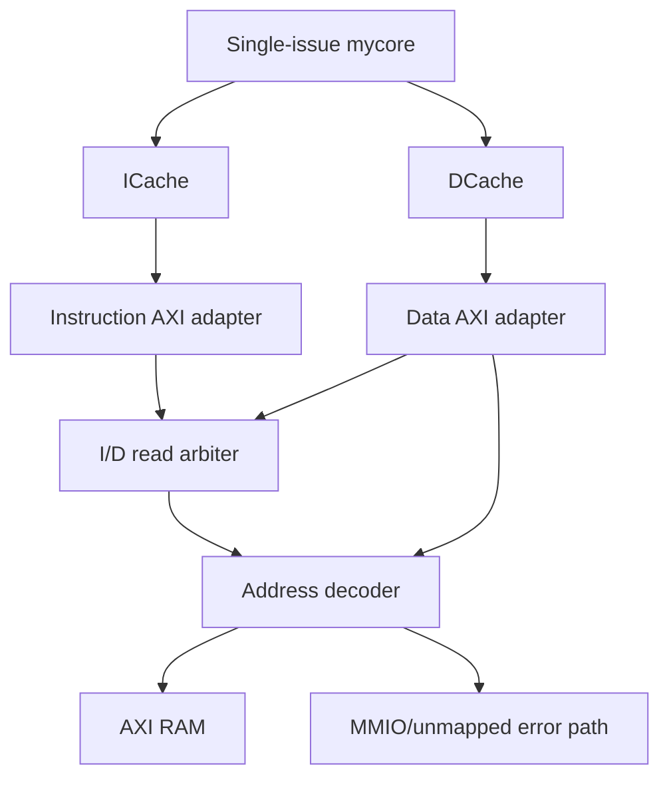

# ysyx-mycore

`ysyx-mycore` is an RV32I/M execution-subset and verification project. The default
integration keeps the original single-issue, in-order core as the stable
baseline, adds an AXI4 cache/memory path and differential UVM regression, and
provides separate executable dual-issue and bounded out-of-order experiments.

The advanced cores are deliberately separate tops: they make the roadmap
testable without silently replacing the stable core.

## Progress at a glance

| Area | Implemented scope | Executable evidence | Status |
|---|---|---|---|
| Stable core | Single-issue, in-order documented RV32I/M execution subset | UVM program regression and C-model differential scoreboard | Maintained baseline |
| Reference model | Project integer/control/load-store subset plus all eight RV32M operations, DPI bridge, architectural state | Directed C++ unit tests, UBSan CI, program-level retire checking | Complete for the documented execution subset |
| Cache path | 16-byte-line, four-way ICache and DCache; DCache refill and dirty write-back | Baseline program smoke traverses I/D caches; dual integration traverses DCache | Integrated path; dedicated cache UVM scenarios incomplete |
| AXI4 cache-line subset | Fixed I/D IDs, one outstanding transaction per adapter, aligned four-beat 32-bit INCR bursts, I/D read arbitration, D writes, RAM decode and error responses | Procedural random-backpressure, boundary/error, ordering and payload-stability checks | Complete for the bounded subset below |
| AXI verification | Transaction model, basic active master agent, passive monitor, protocol checker, explicit semantic counters and acceptance gates | Three-transaction active UVM smoke plus standalone self-checking AXI subsystem test | Basic agent and directed smoke implemented |
| Cache UVM scenarios | Existing ICache/DCache agent and test-class scaffolding | No dedicated hit/miss/flush/dirty/error acceptance gate yet | Scaffold only |
| Dual issue | Configurable one-/two-wide ordered issue and retirement, dual integer lanes, scalar LSU/control/M path, performance counters | Width-1/width-2 trace equivalence, hazard/control/RV32M tests and AXI/DCache smoke | Bounded phase-4 core |
| Out of order | Two-wide rename/dispatch/commit, RAT/PRF/free list, ROB, reservation station, serialized M unit, conservative LSQ and control recovery | Ordered trace/state scoreboard with ROB-full, independent completion, memory-order and recovery cases | Bounded phase-5 experiment |
| Coverage and CI | Verilator line data/report, raw toggle database, AXI explicit semantic counters, SVA/procedural checks, lint and executable gates | GitHub Actions uploads `coverage.dat`, `coverage.info` and both smoke logs | Evidence generated; no percentage or non-AXI functional threshold yet |

“Complete” in this table refers only to the explicitly stated project scope;
it does not imply a privileged, exception-capable or production SoC core.

## Integrated baseline architecture



The validated AXI4 cache-line subset is:

- 32-bit addresses and 32-bit data;
- 2-bit signals with fixed IDs (`0` for instruction reads and `1` for data
  traffic);
- aligned, full-width 16-byte cache lines transferred as four 32-bit `INCR`
  beats;
- one outstanding transaction per adapter and one read burst selected at a
  time by the I/D arbiter;
- a DCache write path that bypasses the read arbiter, while the DCache adapter
  itself serializes reads and writes and performs AW, W, then B;
- default 16 MiB RAM window at `0x0000_0000`;
- reserved MMIO decode window at `0x1000_0000`, currently terminated with an
  error slave rather than a real peripheral; and
- `DECERR`/`SLVERR` propagation into cache diagnostic fault sidebands.

The RTL does not currently implement narrow, `FIXED` or `WRAP` transfers,
exclusive accesses, beat interleaving, or multi-ID out-of-order completion.

Bus errors are diagnostics, not architectural exceptions. The baseline
wrapper exposes the first fault as a sticky probe, and the dual integration
has an equivalent sticky record. Neither core currently redirects to a trap
handler.

## Processor variants

### Stable single-issue core

`dut/mycore/mycore.v` remains the default processor used by `flist.f` and the
UVM environment. It implements the existing ordered pipeline, hazard/flush
control, integer/M execution units and scalar instruction/data request ports.
For program tests, `mycore_wrapper` selects the ICache/DCache/AXI memory path;
module-level tests may still use the direct memory agents.

### Dual-issue in-order core

`dut/mycore/mycore_dual.v` is a configurable `ISSUE_WIDTH=1|2` acceptance top.
It adds:

- a 128-bit instruction-line frontend and ordered queue;
- two-wide decode, dependency selection and integer execution;
- ordered lane-0/lane-1 retirement with deterministic WAW behavior;
- controlled single issue for loads, stores, control flow and RV32M;
- redirect/stale-response handling; and
- cycle, issued/retired, dual-issue/retire and stall counters.

The two-wide test runs the same architectural traces as width 1 and requires a
material cycle reduction. The checked performance sequence currently reaches
1.897 IPC (68 cycles) at width 2 versus 0.977 IPC (132 cycles) at width 1.

`mycore_dual_axi_wrapper` additionally connects the instruction-line frontend
directly to the instruction AXI adapter and places the existing DCache on the
data side. It therefore verifies **instruction-line AXI + DCache** integration;
it does not claim that the dual frontend passes through the existing ICache.

See [docs/dual-issue-inorder.md](docs/dual-issue-inorder.md) for the handshake,
pairing, redirect and performance contracts.

### Bounded out-of-order core

`dut/mycore/ooo/ooo_core.sv` is a standalone experiment with:

- two-wide fetch, decode, rename, dispatch and oldest-first commit;
- an eight-entry ROB, 48-entry PRF, speculative/committed RATs and free list;
- a unified reservation station with two simple execution lanes;
- a serialized RV32M unit;
- a conservative LSQ in which loads wait for all older stores and stores
  become visible only at the ROB head; and
- predict-not-taken branch/JAL/JALR recovery with younger-state flush and RAT
  reconstruction.

The experiment is intentionally conservative: only one unresolved control
operation and one data request may be outstanding, recovery occurs at the ROB
head, and there is no speculative load bypass or store-to-load forwarding.
See [docs/ooo-core.md](docs/ooo-core.md) for the exact contract and limits.

## Requirements

- GNU Make, a C++17 compiler and Python 3 for the reference-model tests;
- Verilator 5.050 for the checked RTL/UVM flow;
- Accellera UVM 2020.3.1 and Z3 for the UVM constrained-random build; and
- a `riscv64-unknown-elf-*` GCC/binutils toolchain, `xxd`, and `awk` only when
  compiling the source programs under `csrc/`.

Other simulator versions may work, but CI pins Verilator and UVM so the
documented RTL/UVM acceptance results are reproducible.

## Verification

### C/C++ reference model

`C_model/` supplies the software architectural state and instruction model.
It is tested independently and connected to the UVM scoreboard through DPI for
ordered retire comparison.

```sh
make cmodel-test
python3 -m unittest scripts.test_regression
```

The unit suite covers the integer, control-flow and load/store instruction
families implemented by this project and all eight RV32M result forms,
including divide-by-zero and signed-overflow behavior. It does not model
FENCE, SYSTEM, traps or strict illegal-encoding behavior.

### UVM program and cache regression

The UVM build is validated with Verilator 5.050 and Accellera UVM 2020.3.1.
Set `UVM_HOME` to the checked-out UVM source tree:

```sh
export UVM_HOME=/path/to/uvm-core
make build COVERAGE=1
mkdir -p log
make run-only \
  COVERAGE=1 \
  TEST=mem_image_test \
  MEM_FILE=test_bench/programs/axi_smoke.mem \
  TARGET_COMMITS=32 \
  TIMEOUT_CYCLES=20000 \
  SIM_TIMEOUT=50000 \
  LOG=log/axi-smoke.log
verilator_coverage --write-info obj_dir/coverage.info obj_dir/coverage.dat
```

The acceptance gate requires:

- a non-empty program score with no failed, missing or extra retire records;
- legal four-beat cache-line traffic with the expected owner/ID mapping;
- zero AXI protocol-checker errors; and
- zero UVM errors and fatals.

The reusable AXI package contains an active master sequence/sequencer/driver,
a passive monitor, an observer, and explicit semantic coverage/acceptance
counters. These counters are portable UVM logic rather than SystemVerilog
`covergroup` objects.
Protocol assertions check channel stability, burst shape, response ordering and
end-of-test state. See [test_bench/axi/README.md](test_bench/axi/README.md).

### Standalone AXI subsystem test

```sh
verilator --binary --timing -sv -Wall -Wno-fatal \
  --top-module axi_subsystem_tb \
  --Mdir obj_dir_axi \
  -f flist_axi_tb.f
./obj_dir_axi/Vaxi_subsystem_tb
```

This self-checking test covers instruction/data reads, data writes, I/D
contention, RAM base/boundaries, 4 KiB boundaries,
MMIO/unmapped errors, fixed-seed channel backpressure, stable stalled payloads
and final quiescence. Success is `AXI_SUBSYSTEM_TEST PASS`.

### Dual-issue tests

```sh
# Width-1 reference configuration
verilator --binary --timing -sv -Wall -Wno-fatal \
  --top-module dual_issue_core_tb -GISSUE_WIDTH=1 \
  --Mdir obj_dir_dual_1 \
  -f test_bench/dual_issue/flist_dual.f
./obj_dir_dual_1/Vdual_issue_core_tb

# Width-2 configuration
verilator --binary --timing -sv -Wall -Wno-fatal \
  --top-module dual_issue_core_tb -GISSUE_WIDTH=2 \
  --Mdir obj_dir_dual_2 \
  -f test_bench/dual_issue/flist_dual.f
./obj_dir_dual_2/Vdual_issue_core_tb

# Instruction-line AXI + DCache integration
verilator --binary --timing -sv -Wall -Wno-fatal \
  --top-module dual_axi_smoke_tb \
  --Mdir obj_dir_dual_axi \
  -f test_bench/dual_issue/flist_dual_axi.f
./obj_dir_dual_axi/Vdual_axi_smoke_tb
```

CI compares the complete width-1/width-2 ordered traces, checks the performance
ratio, and exercises RAW/WAR/WAW/x0 cases, legal and illegal LSU encodings, all
RV32M operations, memory backpressure, branch/JAL/JALR recovery and wrong-path
suppression. The AXI integration smoke forces same-set DCache dirty evictions
and concurrent instruction/data traffic.

### Out-of-order acceptance test

```sh
verilator --binary -sv -Wall -Wno-fatal \
  --top-module ooo_core_tb \
  --Mdir obj_dir_ooo \
  -f flist_ooo.f
./obj_dir_ooo/Vooo_core_tb
```

The scoreboard checks ordered retirement and final architectural state while
the test observes younger independent completion behind a long-latency M
operation, ROB-full pressure, renaming dependencies, conservative load/store
ordering and control-flow recovery. Success is `OOO_CORE_TEST PASS`.

### Source-program regression

With a `riscv64-unknown-elf-*` toolchain available, the regression helper
builds images using `-march=rv32im`, runs each image, parses the score markers
and returns a non-zero status on build, simulator, timeout, UVM or scoreboard
failure:

```sh
make regression
make coverage
```

## Repository layout

| Path | Purpose |
|---|---|
| `dut/mycore/` | Stable core, dual-issue core and bounded OoO experiment |
| `dut/mem/` | ICache, DCache and AXI RAM |
| `dut/axi/` | Cache adapters, read arbiter, decoder and error slave |
| `C_model/` | Documented execution-subset reference model, DPI bridge and unit tests |
| `test_bench/agent/` | Existing instruction, data, cache and retire UVM agents |
| `test_bench/axi/` | AXI UVM components and self-checking standalone test support |
| `test_bench/dual_issue/` | Width A/B and dual AXI/DCache tests |
| `test_bench/ooo/` | Bounded OoO acceptance test |
| `scripts/` | Image build, regression parsing and helper tests |
| `.github/workflows/` | Lint, reference, RTL, UVM and coverage gates |

## Deliberate limits and remaining work

The implemented architectural scope is the documented RV32I integer,
control-flow and load/store subset plus RV32M arithmetic. The project does not
yet provide FENCE, SYSTEM/CSR behavior, strict illegal-encoding semantics,
compressed instructions, atomics, floating point, architectural exceptions,
interrupts, privilege levels, an MMU, or production MMIO peripherals.
Misaligned and bus-error handling is diagnostic rather than trap-based.

The main remaining engineering work is to:

1. integrate a chosen advanced core into the full stable ICache/DCache top
   instead of keeping it as a separately gated experiment;
2. add architectural exception/interrupt/CSR and precise bus-fault handling;
3. replace the MMIO error terminator with real peripheral slaves;
4. implement directed UVM cache scenarios for ICache hit/miss/flush and DCache
   hit/miss, byte masks, cross-line access, dirty eviction and error handling;
5. extend the active AXI agent with constrained-random, negative-response,
   narrow/other-burst (if added to RTL) and multi-outstanding stress, while
   broadening control recovery tests and running the advanced cores against
   the DPI C model on generated programs; and
6. add ISA/cache/dual/OoO functional models and set reviewed line/toggle and
   functional coverage thresholds after the current evidence has a stable
   baseline.

These boundaries are intentional: implemented paths have executable smoke or
acceptance evidence, while incomplete cache scenarios, stress coverage, SoC
integration and privileged-architecture work remain explicit.
