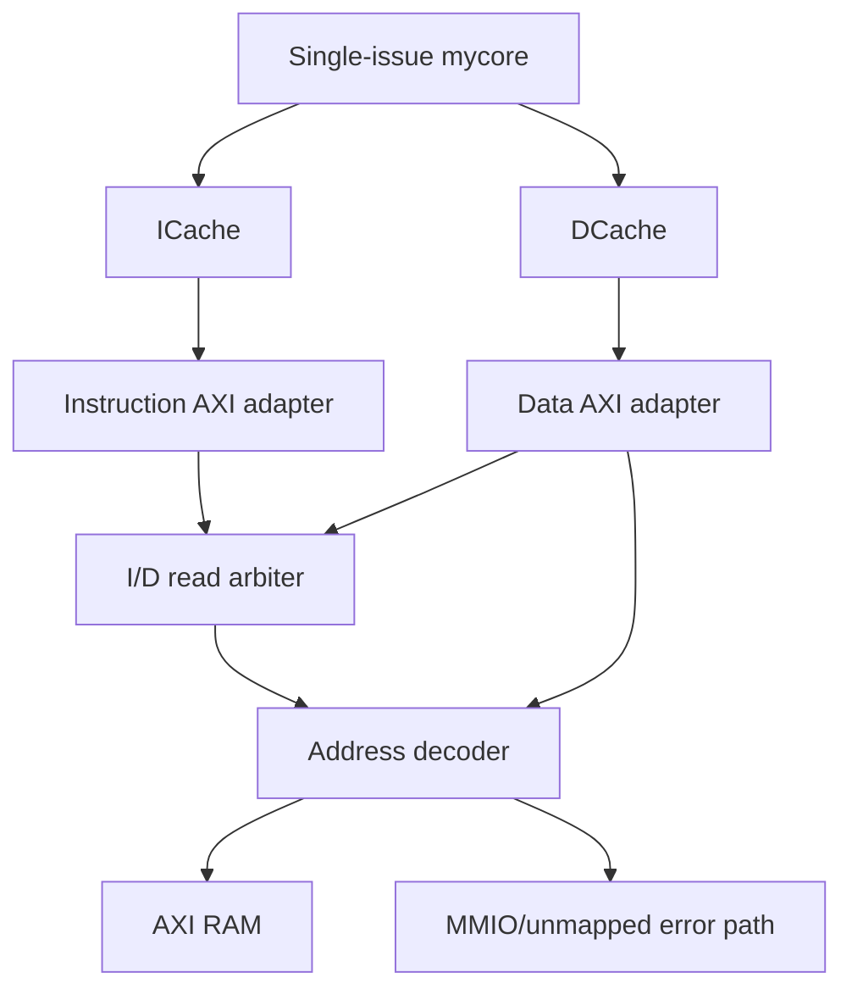

# ysyx-mycore

`ysyx-mycore` is an RV32I/M execution-subset and verification project. The default
integration keeps the original single-issue, in-order core as the stable
baseline, adds an AXI4 cache/memory path and differential UVM regression, and
provides separate executable dual-issue and bounded out-of-order experiments.

The advanced cores are deliberately separate tops: they make the roadmap
testable without silently replacing the stable core.

## Progress at a glance

| Area | Implemented scope | Executable evidence | Status |
|---|---|---|---|
| Stable core | Single-issue, in-order documented RV32I/M execution subset, including ordered side-effect-free FENCE retirement | UVM program regression and C-model differential scoreboard | Maintained baseline |
| Reference model | Project integer/control/load-store subset, FENCE and all eight RV32M operations; DPI bridge and architectural state | Directed C++ unit tests, UBSan CI, program-level retire checking | Complete for the documented execution subset |
| Cache path | 16-byte-line, four-way ICache and DCache; explicit ICache invalidation; DCache refill and dirty write-back | Baseline/dual integration plus a direct-controller gate with 36 required semantic bins and 304 checks | Complete for the implemented controller interfaces |
| AXI4 cache-line subset | Fixed I/D IDs, one outstanding transaction per adapter, aligned four-beat 32-bit INCR bursts, I/D read arbitration, D writes, RAM decode and error responses | Procedural random-backpressure, boundary/error, ordering and payload-stability checks | Complete for the bounded subset below |
| AXI verification | Active master agent, passive monitor, protocol checker and explicit semantic counters | Directed UVM gate: 19 transactions/58 checks; two fixed-seed random gates: 64 transactions (32R/32W) each; standalone subsystem gate | Complete for the single-outstanding cache-line subset |
| Cache UVM scenarios | Active sequencer/driver/monitor agent, delayed/backpressured memory model and reference scoreboard around the real ICache/DCache RTL | 29 required semantic bins; 54 monitored completions, 32 read-data checks, 19 writes and three control operations | Complete for the bounded controller-level scenario |
| Dual issue | Configurable one-/two-wide ordered issue and retirement, dual integer lanes, scalar LSU/control/M/FENCE path, performance counters | DPI C-model retire/memory/final-state oracle, width trace equivalence, FENCE serialization, AXI/DCache smoke and 22-bin width-2 semantic gate | Complete as a bounded standalone phase-4 core |
| Out of order | Two-wide rename/dispatch/commit, RAT/PRF/free list, ROB, reservation station, serialized M/FENCE execution, conservative LSQ and control recovery | DPI C-model retire/memory/final-state oracle, FENCE ordering and 29-bin ROB/LSQ/recovery semantic gate | Complete as a bounded standalone phase-5 experiment |
| Cross-core equivalence | One fixed RV32I/M/FENCE program executed by stable, dual-width-1, dual-width-2 and OoO tops | C-model retire/memory/state checks plus identical register, memory, retire and memory-trace hashes across all four implementations | Blocking common-program gate enabled |
| Coverage and CI | ISA, direct/UVM cache, dual/OoO semantic gates, source-program regression and merged Verilator code coverage | ISA 58/58, direct cache 36/36, Cache UVM 29/29, dual 22/22, OoO 29/29, source programs 5/5; eight `dut/**` databases gated at line >=75% and toggle >=35% | Blocking functional and code-coverage thresholds enabled |

“Complete” in this table refers only to the explicitly stated project scope;
it does not imply a privileged, exception-capable or production SoC core.

## Integrated baseline architecture



The validated AXI4 cache-line subset is:

- 32-bit addresses and 32-bit data;
- 2-bit signals with fixed IDs (`0` for instruction reads and `1` for data
  traffic);
- aligned, full-width 16-byte cache lines transferred as four 32-bit `INCR`
  beats;
- one outstanding transaction per adapter and one read burst selected at a
  time by the I/D arbiter;
- a DCache write path that bypasses the read arbiter, while the DCache adapter
  itself serializes reads and writes and performs AW, W, then B;
- default 16 MiB RAM window at `0x0000_0000`;
- reserved MMIO decode window at `0x1000_0000`, currently terminated with an
  error slave rather than a real peripheral; and
- `DECERR`/`SLVERR` propagation into cache diagnostic fault sidebands.

The RTL does not currently implement narrow, `FIXED` or `WRAP` transfers,
exclusive accesses, beat interleaving, or multi-ID out-of-order completion.

Bus errors are diagnostics, not architectural exceptions. The baseline
wrapper exposes the first fault as a sticky probe, and the dual integration
has an equivalent sticky record. Neither core currently redirects to a trap
handler.

## Processor variants

### Stable single-issue core

`dut/mycore/mycore.v` remains the default processor used by `flist.f` and the
UVM environment. It implements the existing ordered pipeline, hazard/flush
control, integer/M execution units and scalar instruction/data request ports.
For program tests, `mycore_wrapper` selects the ICache/DCache/AXI memory path;
module-level tests may still use the direct memory agents.

### Dual-issue in-order core

`dut/mycore/mycore_dual.v` is a configurable `ISSUE_WIDTH=1|2` acceptance top.
It adds:

- a 128-bit instruction-line frontend and ordered queue;
- two-wide decode, dependency selection and integer execution;
- ordered lane-0/lane-1 retirement with deterministic WAW behavior;
- controlled single issue for loads, stores, control flow, FENCE and RV32M;
- redirect/stale-response handling; and
- cycle, issued/retired, dual-issue/retire and stall counters.

The two-wide test runs the same architectural traces as width 1 and requires a
material cycle reduction. The checked performance sequence currently reaches
1.897 IPC (68 cycles) at width 2 versus 0.977 IPC (132 cycles) at width 1.

`mycore_dual_axi_wrapper` additionally connects the instruction-line frontend
directly to the instruction AXI adapter and places the existing DCache on the
data side. It therefore verifies **instruction-line AXI + DCache** integration;
it does not claim that the dual frontend passes through the existing ICache.

See [docs/dual-issue-inorder.md](docs/dual-issue-inorder.md) for the handshake,
pairing, redirect and performance contracts.

### Bounded out-of-order core

`dut/mycore/ooo/ooo_core.sv` is a standalone experiment with:

- two-wide fetch, decode, rename, dispatch and oldest-first commit;
- an eight-entry ROB, 48-entry PRF, speculative/committed RATs and free list;
- a unified reservation station with two simple execution lanes;
- a serialized RV32M unit;
- an explicit FENCE class that executes at the ROB head, retires alone and
  blocks younger execution and memory traffic;
- a conservative LSQ in which loads wait for all older stores and stores
  become visible only at the ROB head; and
- predict-not-taken branch/JAL/JALR recovery with younger-state flush and RAT
  reconstruction.

The experiment is intentionally conservative: at most one unresolved
control-flow operation and one unresolved FENCE may be present, only one data
request may be outstanding, recovery occurs at the ROB head, and there is no
speculative load bypass or store-to-load forwarding.
See [docs/ooo-core.md](docs/ooo-core.md) for the exact contract and limits.

## Requirements

- GNU Make, a C++17 compiler and Python 3 for the reference-model tests;
- a C++20-capable host compiler for the timing-enabled standalone Cache UVM
  build;
- Verilator 5.050 for the checked RTL/UVM flow;
- Accellera UVM 2020.3.1 for UVM builds. The documented active AXI directed
  and seeded-random sequences are solver-free; the root program regression
  still configures Z3 for legacy constraint-bearing UVM sequences; and
- a `riscv64-unknown-elf-*` GCC/binutils toolchain, `xxd`, and `awk` only when
  compiling the source programs under `csrc/`.

Other simulator versions may work, but CI pins Verilator and UVM so the
documented RTL/UVM acceptance results are reproducible.

## Verification

### C/C++ reference model

`C_model/` supplies the independent architectural oracle used by the baseline
UVM scoreboard and the advanced standalone tops. The dual width-1/width-2 and
bounded OoO tests derive ordered retirement and memory-access traces and then
compare complete final register and test-memory state. The dual AXI/DCache test
checks its complete ordered retire/memory-request traces, all 32 registers and
the two directed dirty-eviction words after they reach backing RAM; it does not
claim a full cache-resident memory snapshot.

```sh
make cmodel-test
python3 -m unittest scripts.test_regression scripts.test_coverage
```

The unit suite covers the integer, control-flow and load/store instruction
families implemented by this project and all eight RV32M result forms,
including divide-by-zero and signed-overflow behavior. It does not model
FENCE.I, SYSTEM, traps or strict illegal-encoding behavior. FENCE is modeled
as an ordered, side-effect-free retirement; because model memory operations
complete synchronously, every older access has completed before the next
instruction is stepped.

Advanced-core differential runs emit independent-oracle markers such as:

```text
REFERENCE_ORACLE PASS width=...
REFERENCE_STATE PASS width=...
DUAL_AXI_REFERENCE_ORACLE PASS ...
DUAL_AXI_REFERENCE_STATE PASS ...
OOO_REFERENCE_ORACLE PASS ...
OOO_REFERENCE_STATE PASS ...
OOO_FENCE_ORDER PASS retired_alone=1 younger_load_blocked=1
CROSS_CORE_ORACLE PASS impl=... retired=10 memory_ops=2 fence=1
CROSS_CORE_STATE PASS impl=... regs=32 memory_bytes=256 retired=10 memory_ops=2 fence=1
```

### Baseline UVM program regression and ISA coverage

The UVM build is validated with Verilator 5.050 and Accellera UVM 2020.3.1.
Set `UVM_HOME` to the checked-out UVM source tree:

```sh
export UVM_HOME=/path/to/uvm-core
make build COVERAGE=1
mkdir -p log
make run-only \
  COVERAGE=1 \
  TEST=mem_image_test \
  MEM_FILE=test_bench/programs/axi_smoke.mem \
  TARGET_COMMITS=32 \
  TIMEOUT_CYCLES=20000 \
  SIM_TIMEOUT=50000 \
  LOG=log/axi-smoke.log
verilator_coverage --write-info obj_dir/coverage.info obj_dir/coverage.dat
```

The deterministic RV32I/M coverage image runs through the same UVM environment:

```sh
make run-only \
  COVERAGE=1 \
  COVERAGE_FILE=obj_dir/coverage-rv32im.dat \
  TEST=mem_image_test \
  MEM_FILE=test_bench/programs/rv32im_coverage.mem \
  TARGET_COMMITS=67 \
  REQUIRE_ISA_COVERAGE=1 \
  TIMEOUT_CYCLES=30000 \
  SIM_TIMEOUT=100000 \
  LOG=log/rv32im-coverage.log
```

It must report:

```text
ISA_COVERAGE status=PASS required=58 hit=58 missing=0 instr=46/46 branch=12/12 missing_bins=none
```

The 58 bins cover all 46 instruction encodings in the documented execution
subset, including FENCE, and taken/not-taken outcomes for each of the six
branch encodings. The
direction sampler infers the outcome from the next ordered retirement PC, so
it is intended for this directed, exception-free program rather than a future
exception-capable trace.

The acceptance gate requires:

- a non-empty program score with no failed, missing or extra retire records;
- legal four-beat cache-line traffic with the expected owner/ID mapping;
- zero AXI protocol-checker errors; and
- zero UVM errors and fatals.

The reusable AXI package contains an active master sequence/sequencer/driver,
a passive monitor, an observer, and explicit semantic coverage/acceptance
counters. These counters are portable UVM logic rather than SystemVerilog
`covergroup` objects.
Protocol assertions check channel stability, burst shape, response ordering and
end-of-test state. See [test_bench/axi/README.md](test_bench/axi/README.md).

### Direct cache semantic regression

The cache gate is a non-UVM, controller-level test at the CPU and line-memory
interfaces:

```sh
make -C test_bench/cache run
```

It requires all 36 semantic bins and 304 explicit checks:

```text
ICACHE_DIRECTED_TEST: PASS memory_reads=14
DCACHE_DIRECTED_TEST: PASS memory_reads=25 writebacks=3
CACHE_COVERAGE status=PASS required=36 hit=36 missing=0
CACHE_DIRECTED_ACCEPTANCE status=PASS checks=304 ic_reads=14 dc_reads=25 dc_writebacks=3
```

The gate covers cache-line offsets, cold refill and hits, fill-age replacement,
DCache clean/dirty eviction and write-back, seven byte-mask shapes, partial
RAW behavior, backpressure and SLVERR/DECERR retention. The ICache RTL now has
an explicit flush port; this older directed gate keeps it deasserted and checks
reset invalidation, while the Cache UVM gate below exercises both paths.
DCache cross-line writes are not implemented and are not claimed as a covered
scenario. See
[test_bench/cache/README.md](test_bench/cache/README.md).

### Active Cache UVM regression

`test_bench/cache_uvm/` wraps the real `Icache.v`, `Dcache.v` and `one_set.v`
modules in an active UVM sequencer/driver/monitor agent. A deterministic memory
model supplies bounded zero/mid/long post-handshake delay buckets, real ready
backpressure, error responses and parallel I/D service. Responses never
coincide with their accepting request edge. The scoreboard independently
checks CPU-visible read data, byte-write effects and completion order.

```sh
export UVM_HOME=/path/to/uvm-core
make -C test_bench/cache_uvm run
```

The blocking result is:

```text
CACHE_UVM_COVERAGE status=PASS required=29 hit=29 missing=0 ... ic_flush=2 ic_inflight_flush=1 ...
CACHE_UVM_ORDER status=PASS ... order_errors=0 data_errors=0
CACHE_UVM_TEST status=PASS transactions=54 checks=32 reads=32 writes=19 controls=3 uvm_errors=0
```

The 29 bins cover ICache hit/miss, consecutive and same-set misses, explicit
flush and reset invalidation, in-flight flush drain with stale-SLVERR
suppression and a fresh replacement refill, non-allocating SLVERR/DECERR responses, DCache
read/write hit/miss, dirty write-back and refetch, failed-writeback retention,
refill errors, eight WSTRB shapes with immediate RAW reads, a cross-line read,
all three post-handshake response-delay classes, accepted-request backpressure
and genuinely overlapping I/D pending cycles. Empty expected queues and zero
UVM errors are mandatory. See
[test_bench/cache_uvm/README.md](test_bench/cache_uvm/README.md).

### Active AXI UVM regression

The active AXI gate builds one UVM testbench and runs:

- a 19-transaction directed sequence with 58 checks, 13 reads and six writes;
- seed `13579bdf`, with exactly 64 transactions (32R/32W); and
- seed `2468ace1`, with exactly 64 transactions (32R/32W).

Both random runs require owner/ID coverage, all delay and WSTRB classes, actual
AW/W/B/AR/R stall cycles and OKAY/SLVERR/DECERR in both directions. Each seed
uses 30 unique successful-write addresses with 30 dependency-safe readbacks;
the two error-write addresses must also read back unchanged. Empty final
monitor queues and zero protocol/UVM errors are mandatory. The active agent
remains single-outstanding and validates only the aligned four-beat INCR subset
implemented by the RTL. Exact commands and markers are documented in
[test_bench/axi/README.md](test_bench/axi/README.md).

### Standalone AXI subsystem test

```sh
verilator --binary --timing -sv -Wall -Wno-fatal \
  --top-module axi_subsystem_tb \
  --Mdir obj_dir_axi \
  -f flist_axi_tb.f
./obj_dir_axi/Vaxi_subsystem_tb
```

This self-checking test covers instruction/data reads, data writes, I/D
contention, RAM base/boundaries, 4 KiB boundaries,
MMIO/unmapped errors, fixed-seed channel backpressure, stable stalled payloads
and final quiescence. Success is `AXI_SUBSYSTEM_TEST PASS`.

### Dual-issue tests

```sh
# Width-1 reference configuration
verilator --binary --timing -sv -Wall -Wno-fatal \
  --top-module dual_issue_core_tb -GISSUE_WIDTH=1 \
  --Mdir obj_dir_dual_1 \
  -CFLAGS "-std=c++17 -I${PWD}/C_model" \
  -f test_bench/dual_issue/flist_dual.f
./obj_dir_dual_1/Vdual_issue_core_tb

# Width-2 configuration
verilator --binary --timing -sv -Wall -Wno-fatal \
  --top-module dual_issue_core_tb -GISSUE_WIDTH=2 \
  --Mdir obj_dir_dual_2 \
  -CFLAGS "-std=c++17 -I${PWD}/C_model" \
  -f test_bench/dual_issue/flist_dual.f
./obj_dir_dual_2/Vdual_issue_core_tb

# Instruction-line AXI + DCache integration
verilator --binary --timing -sv -Wall -Wno-fatal \
  --top-module dual_axi_smoke_tb \
  --Mdir obj_dir_dual_axi \
  -CFLAGS "-std=c++17 -I${PWD}/C_model" \
  -f test_bench/dual_issue/flist_dual_axi.f
./obj_dir_dual_axi/Vdual_axi_smoke_tb
```

Before DUT execution, the DPI C model independently creates the ordered
retirement and memory traces plus final register/memory state for the
standalone width-1/width-2 runs. CI checks that oracle, enforces the performance
ratio, and exercises RAW/WAR/WAW/x0 cases, legal and illegal LSU encodings, all
RV32M operations, serialized side-effect-free FENCE retirement, memory
backpressure, branch/JAL/JALR recovery and wrong-path suppression. The AXI
integration smoke forces same-set DCache dirty evictions and concurrent
instruction/data traffic; its C-model gate compares all 32 registers, the
ordered memory requests and two directed words after write-back to RAM.

The standalone semantic gate must report:

```text
DUAL_COVERAGE status=PASS width=1 required=2 hit=2 missing=0
DUAL_COVERAGE status=PASS width=2 required=22 hit=22 missing=0
```

Width 1 additionally treats any lane-1 issue or retirement as fatal. The
width-2 bins cover issue/retire width, execution classes, real versus false
dependencies, memory stalls and control-flow/stale-response recovery. CI also
requires the FENCE trace to retire alone with no register or memory side effect.

### Out-of-order acceptance test

```sh
verilator --binary -sv -Wall -Wno-fatal \
  --top-module ooo_core_tb \
  --Mdir obj_dir_ooo \
  -CFLAGS "-std=c++17 -I${PWD}/C_model" \
  -f flist_ooo.f
./obj_dir_ooo/Vooo_core_tb
```

The DPI C model independently generates the ordered retirement and
memory-access traces plus final register/memory state. The test compares all
three while separately observing younger independent completion behind a
long-latency M operation, ROB-full pressure, renaming dependencies,
conservative load/store ordering and control-flow recovery. Its semantic gate
is:

```text
OOO_COVERAGE status=PASS required=29 hit=29 missing=0
OOO_FENCE_ORDER PASS retired_alone=1 younger_load_blocked=1
```

The bins include one-/two-wide dispatch and commit, both ALU lanes, M and
memory completion, same-packet RAW/WAR/WAW, ROB-full and ordering blocks,
correct not-taken control plus BEQ/JAL/JALR recovery, flushed younger work and
x0 completion suppression, plus a real non-reset ROB nonempty-to-empty
transition. FENCE receives its own serialized class: it executes only as the
ROB head, retires alone and prevents younger execution/memory work from
crossing it. Final success is `OOO_CORE_TEST PASS`.

### Cross-core common-program gate

`test_bench/cross_core/` runs the same fixed program through the stable core,
dual issue at widths 1 and 2, and the bounded OoO core. The program retires ten
instructions, performs two data-memory operations and retires one FENCE. For
each implementation the test checks every retire and memory event against the
C model, then checks all 32 registers and 256 initially-zero data-memory bytes.
CI additionally
normalizes and compares register, memory, retire-trace and memory-trace hashes
against the stable implementation:

```sh
set -euo pipefail
implementations=(stable dual1 dual2 ooo)
for core_kind in "${!implementations[@]}"; do
  implementation="${implementations[$core_kind]}"
  verilator --binary --timing -sv -Wall -Wno-fatal \
    --output-split 0 --output-split-cfuncs 0 \
    --top-module cross_core_equivalence_tb \
    -GCORE_KIND="${core_kind}" --Mdir "obj_dir_cross_${implementation}" \
    -CFLAGS "-std=c++17 -I${PWD}/C_model" \
    -f test_bench/cross_core/flist_cross_core.f
  "./obj_dir_cross_${implementation}/Vcross_core_equivalence_tb" | \
    tee "cross-core-${implementation}.log"
  grep -Fq \
    "CROSS_CORE_ORACLE PASS impl=${implementation} retired=10 memory_ops=2 fence=1" \
    "cross-core-${implementation}.log"
  grep -Fq \
    "CROSS_CORE_STATE PASS impl=${implementation} regs=32 memory_bytes=256 retired=10 memory_ops=2 fence=1" \
    "cross-core-${implementation}.log"
  sed -n \
    "s/^CROSS_CORE_SUMMARY impl=${implementation} /CROSS_CORE_SUMMARY /p" \
    "cross-core-${implementation}.log" > \
    "cross-core-${implementation}.summary"
  test "$(wc -l < "cross-core-${implementation}.summary")" -eq 1
done
for implementation in dual1 dual2 ooo; do
  diff -u cross-core-stable.summary "cross-core-${implementation}.summary"
done
echo 'CROSS_CORE_EQUIVALENCE PASS implementations=4 oracle=cmodel reference=stable'
```

The four runs must emit:

```text
CROSS_CORE_ORACLE PASS impl=<stable|dual1|dual2|ooo> retired=10 memory_ops=2 fence=1
CROSS_CORE_STATE PASS impl=<stable|dual1|dual2|ooo> regs=32 memory_bytes=256 retired=10 memory_ops=2 fence=1
CROSS_CORE_SUMMARY impl=<stable|dual1|dual2|ooo> regs=<hash> memory=<hash> retire=<hash> memtrace=<hash> retired=10 memory_ops=2 fence=1
CROSS_CORE_EQUIVALENCE PASS implementations=4 oracle=cmodel reference=stable
```

This is a second, common-program integration check, not a claim that the four
tops are equivalent for every legal program or unsupported architectural case.

### Functional and merged code coverage

The blocking functional gates are the 58-bin ISA program, 36-bin direct cache
test, 29-bin Cache UVM test, 22-bin dual-issue configuration and 29-bin OoO test
described above. AXI uses explicit transaction, response, strobe, owner and
backpressure-cycle counters rather than simulator-specific covergroups.

GitHub Actions additionally merges eight Verilator databases:

1. two baseline UVM program runs;
2. the standalone AXI subsystem;
3. the direct cache regression;
4. dual width 1;
5. dual width 2;
6. dual AXI/DCache integration; and
7. the bounded OoO core.

Only `dut/**` points count toward the code-coverage decision. A point is
covered after at least one hit; line coverage must be at least 75% and toggle
coverage at least 35%. Branch coverage is reported but is currently
non-blocking. The gate prints the full measured and threshold counts:

```text
CODE_COVERAGE status=PASS scope=dut/** inputs=8 covered_min_hits=1 line_pct=... line_covered=... line_total=... line_min=75.00 line_blocking=1 toggle_pct=... toggle_covered=... toggle_total=... toggle_min=35.00 toggle_blocking=1 branch_pct=... branch_covered=... branch_total=... branch_min=0.00 branch_blocking=0
```

The workflow uploads `verilator-coverage`, `rtl-functional-coverage` and
`coverage-threshold-summary`; the last artifact contains the merged
`coverage-summary.txt` decision.

### Source-program regression

With a `riscv64-unknown-elf-*` toolchain available, the regression helper
discovers the top-level `csrc/*.cpp` programs, rejects duplicate basenames that
would overwrite an image, builds each with `-march=rv32im`, runs the image and
parses its score markers. It returns a non-zero status on image or simulator
build failure, timeout, UVM error/fatal, missing score, or scoreboard failure:

```sh
make regression
make coverage
```

The dedicated GitHub Actions workflow installs the cross toolchain and gates
`make regression` on the current five source programs:

```text
Passed: 5  Failed: 0
```

`make coverage` is a separate local convenience command. Its databases are not
part of the eight-input merged CI threshold described above.

## Repository layout

| Path | Purpose |
|---|---|
| `dut/mycore/` | Stable core, dual-issue core and bounded OoO experiment |
| `dut/mem/` | ICache, DCache and AXI RAM |
| `dut/axi/` | Cache adapters, read arbiter, decoder and error slave |
| `C_model/` | Documented execution-subset reference model, DPI bridge and unit tests |
| `test_bench/agent/` | Existing instruction, data, cache and retire UVM agents |
| `test_bench/axi/` | AXI UVM components and self-checking standalone test support |
| `test_bench/cache/` | Direct ICache/DCache semantic regression |
| `test_bench/cache_uvm/` | Active Cache UVM agent, memory model, scoreboard and 29-bin gate |
| `test_bench/coverage/` | ISA required-bin coverage subscriber |
| `test_bench/cross_core/` | Four-implementation common-program differential gate |
| `test_bench/dual_issue/` | Width A/B and dual AXI/DCache tests |
| `test_bench/ooo/` | Bounded OoO acceptance test |
| `scripts/` | Image build, regression parsing and helper tests |
| `.github/workflows/` | Lint, reference, RTL, UVM and coverage gates |

## Deliberate limits and remaining work

The implemented architectural scope is the documented RV32I integer,
control-flow and load/store subset, ordered FENCE, plus RV32M arithmetic. The
project does not yet provide FENCE.I/Zifencei, SYSTEM/CSR behavior, strict
illegal-encoding semantics, compressed instructions, atomics, floating point,
architectural exceptions, interrupts, privilege levels, an MMU, or production
MMIO peripherals. Misaligned accesses are outside the contract; bus-error
handling is diagnostic rather than trap-based.

The main remaining engineering work is to:

1. integrate a chosen advanced core into the full stable ICache/DCache top
   instead of keeping it as a separately gated experiment;
2. add architectural exception/interrupt/CSR and precise bus-fault handling;
3. replace the MMIO error terminator with real peripheral slaves;
4. extend the bounded Cache UVM suite with longer multi-seed random soak runs,
   add a DCache cross-line-write interface/behavior contract, and connect the
   ICache maintenance input to software-visible FENCE.I only if Zifencei is
   added to the architectural scope;
5. extend AXI beyond the implemented single-outstanding cache-line subset with
   multi-outstanding/multi-ID ordering and, only after matching RTL support,
   narrow, `FIXED` or `WRAP` transfers; retain longer multi-seed soak runs; and
6. broaden the fixed source/common-program differential gates to generated
   programs, and periodically review the blocking line/toggle thresholds and
   the currently non-blocking branch metric.

These boundaries are intentional: implemented paths have executable smoke or
acceptance evidence, while broader cache/AXI/SoC integration,
generated-program verification and privileged-architecture work remain
explicit.
